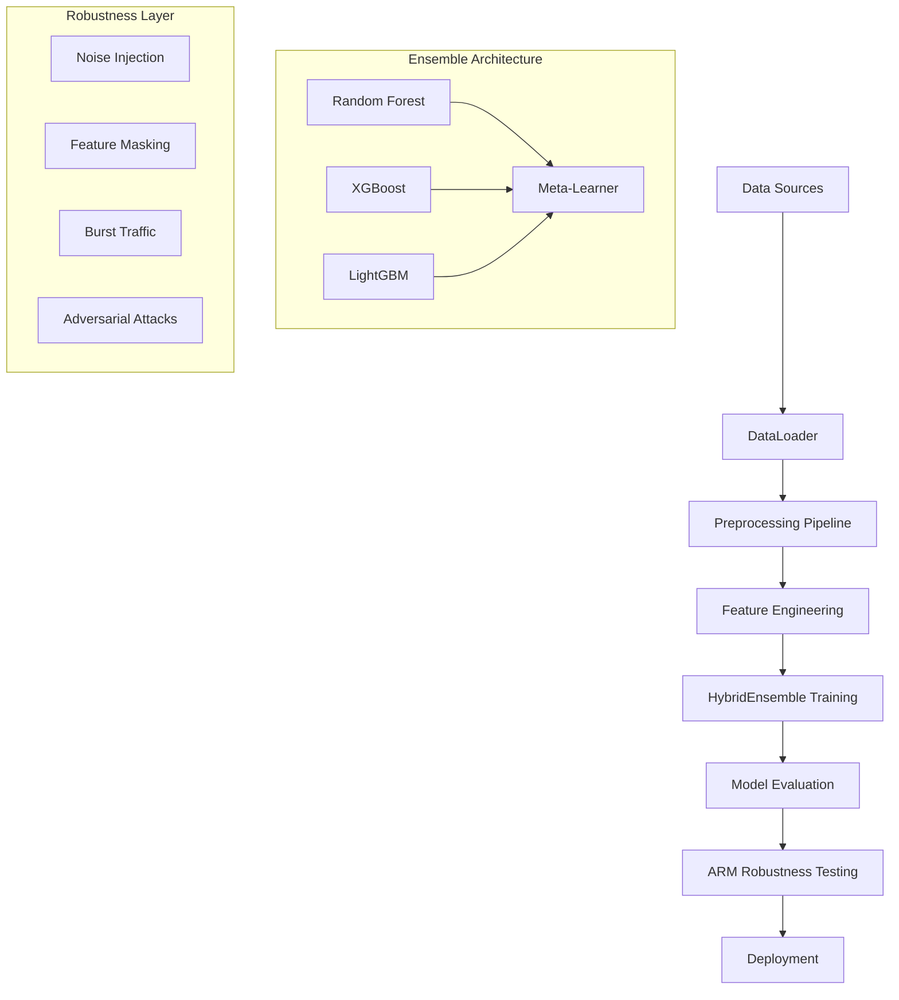
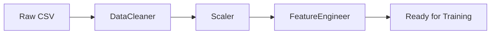
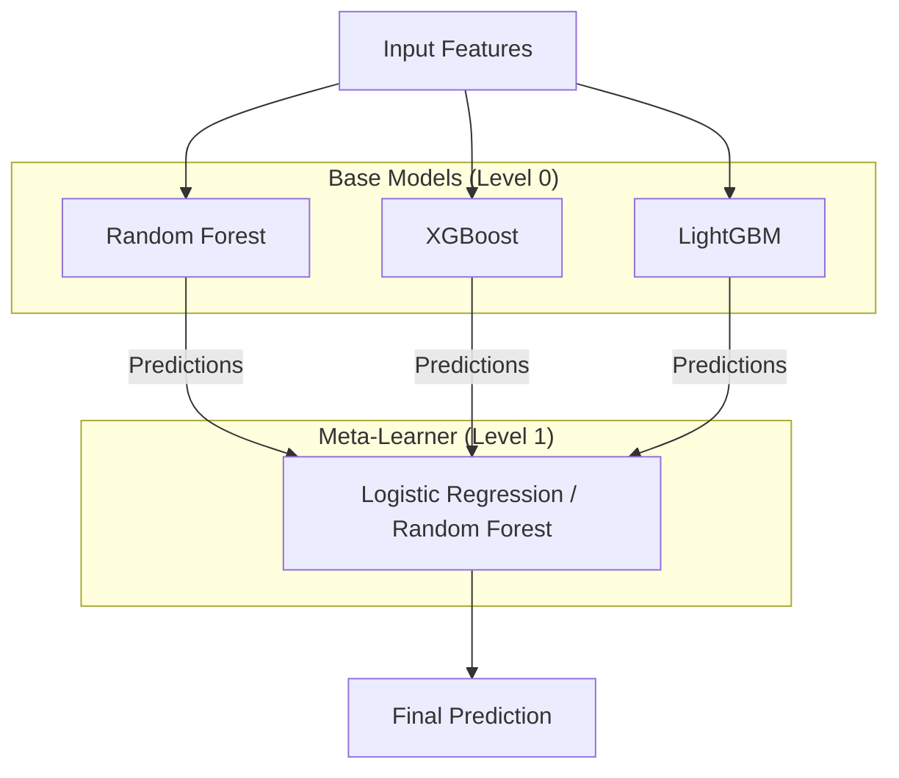
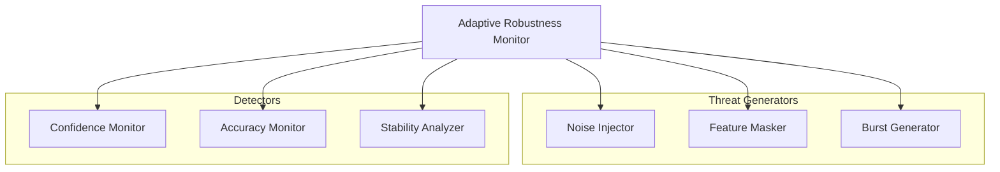
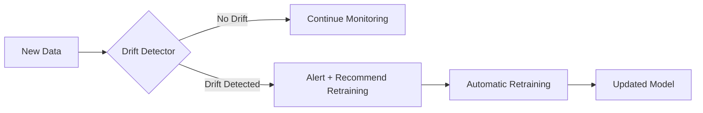
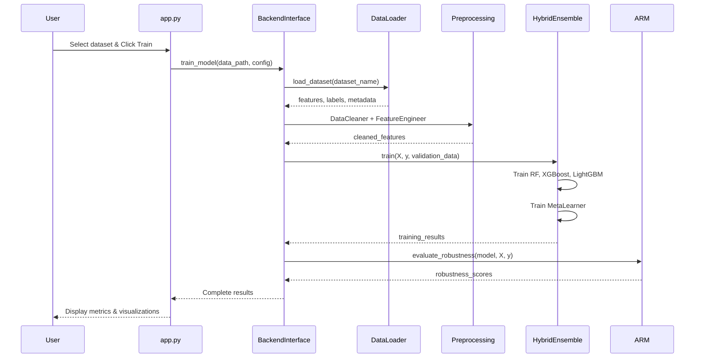

# Enhanced IoT BotScan - Comprehensive Project Documentation

**Author**: Kotiwale Sumesh Singh (160124862043)

---

## Table of Contents

1. [Project Purpose](#1-project-purpose)
2. [Project Architecture Overview](#2-project-architecture-overview)
3. [Directory Structure](#3-directory-structure)
4. [Core Components](#4-core-components)
5. [Data Pipeline](#5-data-pipeline)
6. [Model Training Workflow](#6-model-training-workflow)
7. [Testing and Evaluation](#7-testing-and-evaluation)
8. [ARM (Adaptive Robustness Monitor)](#8-arm-adaptive-robustness-monitor)
9. [Adversarial Defense System](#9-adversarial-defense-system)
10. [Concept Drift Detection](#10-concept-drift-detection)
11. [Frontend Application](#11-frontend-application)
12. [Complete Workflow Summary](#12-complete-workflow-summary)

---

## 1. Project Purpose

**Enhanced IoT BotScan** is a comprehensive **IoT botnet detection system** designed to:

- **Detect malicious botnet traffic** in IoT networks using machine learning
- **Classify attack types** (Mirai, Gafgyt, Bashlite, etc.)
- **Maintain robustness** adversarial behavior and noisy data through perturbation-based stress testing and confidence monitoring.
- **Adapt to concept drift** when attack patterns evolve over time
- **Provide real-time monitoring** through an interactive dashboard

### Key Objectives

| Objective | Description |
|-----------|-------------|
| **Multi-Dataset Training** | Train on N-BaIoT, IoT-23, and BoT-IoT datasets |
| **Hybrid Ensemble** | Use stacking architecture with RF, XGBoost, LightGBM |
| **Adversarial Robustness** | Defend against FGSM, PGD, C&W attacks |
| **Concept Drift Detection** | Detect and adapt to evolving attack patterns |
| **Practical Deployment** | Web dashboard for real-time monitoring |

---

## 2. Project Architecture Overview



---

## 3. Directory Structure

```
enhanced_iot_botscan/
├── app.py                    # Main Streamlit frontend application
├── main.py                   # Backend API entry point
├── config/
│   └── config.yaml           # Dataset paths and configuration
├── data/
│   ├── raw/                  # Raw dataset files
│   │   ├── n_baiot/          # N-BaIoT CSV files
│   │   ├── iot_23/           # IoT-23 CSV files
│   │   └── bot_iot/          # BoT-IoT CSV files
│   └── results/              # Training results and metrics
├── src/
│   ├── core/                 # Core ML modules
│   │   ├── ensemble/         # Hybrid ensemble models
│   │   ├── preprocessing/    # Data preprocessing
│   │   ├── adversarial/      # Adversarial attack/defense
│   │   ├── drift_detection/  # Concept drift detection
│   │   └── robustness/       # ARM robustness monitoring
│   ├── data/                 # Data loading modules
│   ├── evaluation/           # Evaluation metrics
│   ├── streamlit_app/        # Streamlit frontend backend
│   └── api/                  # REST/GraphQL API
├── scripts/                  # Training and evaluation scripts
├── tests/                    # Unit and integration tests
└── models/                   # Saved trained models
```

---

## 4. Core Components

### 4.1 Key Files and Their Purposes

| File | Purpose |
|------|---------|
| `src/data/data_loader.py` | Loads and preprocesses N-BaIoT, IoT-23, BoT-IoT datasets |
| `src/core/ensemble/hybrid_ensemble.py` | Main stacking ensemble with RF, XGBoost, LightGBM |
| `src/core/ensemble/meta_learner.py` | Combines base model predictions into final output |
| `src/core/robustness/arm_robustness_monitor.py` | Adaptive Robustness Monitor for threat evaluation |
| `src/core/preprocessing/feature_engineer.py` | Feature engineering and selection |
| `src/core/adversarial/adversarial_trainer.py` | Adversarial training for robustness |
| `src/core/drift_detection/drift_detector.py` | Concept drift detection |
| `src/streamlit_app/backend_interface.py` | Backend logic for Streamlit frontend |
| `app.py` | Main Streamlit dashboard application |
| `scripts/train_models.py` | Command-line training orchestrator |
| `scripts/evaluate_models.py` | Model evaluation script |

---

## 5. Data Pipeline

### 5.1 Supported Datasets

| Dataset | Description | Attack Types |
|---------|-------------|--------------|
| **N-BaIoT** | Network traffic from 9 IoT devices | Mirai, Gafgyt (Bashlite) |
| **IoT-23** | Zeek-processed network traffic | Various botnet families |
| **BoT-IoT** | Realistic botnet traffic | DDoS, DoS, OS fingerprinting |

### 5.2 Data Loading Process

The `DataLoader` class (`src/data/data_loader.py`) handles all data loading:

```python
class DataLoader:
    def load_n_baiot_dataset()    # Load N-BaIoT from ./data/raw/n_baiot/
    def load_iot_23_dataset()     # Load IoT-23 from ./data/raw/iot_23/
    def load_bot_iot_dataset()    # Load BoT-IoT from ./data/raw/bot_iot/
    def load_unified_dataset()    # Merge all datasets into one
```

#### Label Assignment (N-BaIoT)

Files are labeled based on filename patterns:
- `*benign*` → Label 0 (Benign)
- `*mirai*` → Label 1 (Mirai)
- `*gafgyt*` → Label 2 (Gafgyt)
- `*bashlite*` → Label 3 (Bashlite)

### 5.3 Sampling Strategy

The system uses **memory-efficient chunked loading**:

```python
# Chunked reading for large files
for chunk in pd.read_csv(file_path, chunksize=10000):
    chunks.append(chunk)
```

For unified datasets, **random subsampling** prevents OOM:

```python
if len(unified_df) > max_samples:
    unified_df = unified_df.sample(n=max_samples, random_state=42)
```

### 5.4 Preprocessing Pipeline



| Component | File | Function |
|-----------|------|----------|
| **DataCleaner** | `src/core/preprocessing/data_cleaner.py` | Handle missing values, infinite values, duplicates |
| **Scaler** | `src/core/preprocessing/scaler.py` | StandardScaler, MinMaxScaler normalization |
| **FeatureEngineer** | `src/core/preprocessing/feature_engineer.py` | Statistical features, polynomial features, domain features |

---

## 6. Model Training Workflow

### 6.1 Training Architecture

The system uses a **Stacking Ensemble** architecture:



### 6.2 Training Flow

```
1. Load Dataset        → DataLoader.load_dataset()
2. Clean Data          → DataCleaner.clean()
3. Engineer Features   → FeatureEngineer.engineer_features()
4. Train-Test Split    → 80% train, 20% validation
5. Train Base Models   → RF, XGBoost, LightGBM trained in parallel
6. Generate Meta Data  → Cross-validation predictions from base models
7. Train Meta-Learner  → Combine base predictions
8. Evaluate Ensemble   → Accuracy, Precision, Recall, F1, AUC
9. Save Model          → joblib serialization
```

### 6.3 Files Considered for Training

| Configuration | Files Used |
|---------------|------------|
| **N-BaIoT** | All `*.csv` files in `./data/raw/n_baiot/` |
| **IoT-23** | All `*.csv` files in `./data/raw/iot_23/` |
| **BoT-IoT** | `*sample*.csv` or all `*.csv` in `./data/raw/bot_iot/` |
| **Unified** | All above datasets merged with feature union |

### 6.4 HybridEnsemble Training Code

```python
# From src/core/ensemble/hybrid_ensemble.py
class HybridEnsemble:
    def train(self, X, y, validation_data=None):
        # 1. Train base models
        self.rf_model.train(X_train, y_train)
        self.xgb_model.train(X_train, y_train)
        self.lgb_model.train(X_train, y_train)
        
        # 2. Generate stacking predictions
        stacking_data = StackingEnsemble.generate_stacking_data(
            base_models, X_stack, y_stack
        )
        
        # 3. Train meta-learner
        self.meta_learner.train(stacking_data, y_stack)
```

---

## 7. Testing and Evaluation

### 7.1 Evaluation Metrics

| Metric | Description |
|--------|-------------|
| **Accuracy** | Overall classification accuracy |
| **Precision** | True positives / (True positives + False positives) |
| **Recall** | True positives / (True positives + False negatives) |
| **F1-Score** | Harmonic mean of precision and recall |
| **ROC-AUC** | Area under the ROC curve |
| **Confusion Matrix** | Per-class performance breakdown |

### 7.2 Evaluation Scripts

```bash
# Run model evaluation
python scripts/evaluate_models.py --model ./models/hybrid_ensemble.joblib --datasets n_baiot iot_23

# Cross-dataset evaluation
python scripts/evaluate_models.py --model ./models/hybrid_ensemble.joblib --datasets n_baiot iot_23 bot_iot
```

### 7.3 Testing Files

| Test File | Purpose |
|-----------|---------|
| `tests/unit/test_ensemble.py` | Unit tests for HybridEnsemble |
| `tests/unit/test_preprocessing.py` | Unit tests for preprocessing |
| `tests/unit/test_adversarial.py` | Unit tests for adversarial attacks |
| `tests/validate_multidataset.py` | Validate multi-dataset support |
| `tests/validate_adversarial.py` | Validate adversarial robustness |
| `test_arm.py` | Test ARM robustness monitor |

---

## 8. ARM (Adaptive Robustness Monitor)

### 8.1 What is ARM?

**ARM (Adaptive Robustness Monitor)** is a unified system for monitoring model robustness under:
- **Adversarial conditions** (noise, perturbations)
- **Concept drift** (changing attack patterns)
- **Practical IoT threats** (sensor failures, burst traffic)

### 8.2 ARM Components



### 8.3 Threat Scenarios Evaluated

| Threat Type | Description | Simulation |
|-------------|-------------|------------|
| **Noise Injection** | Gaussian noise at various levels (0%, 5%, 10%, 20%) | Simulates sensor noise |
| **Feature Masking** | Random features set to zero (0%, 10%, 20%, 30%) | Simulates sensor failures |
| **Burst Traffic** | Amplified feature values (1x, 1.5x, 2x) | Simulates traffic spikes |

### 8.4 ARM Evaluation Process

```python
# From src/core/robustness/arm_robustness_monitor.py
class AdaptiveRobustnessMonitor:
    def evaluate_comprehensive_robustness(self, model, X, y):
        # 1. Establish baseline on clean data
        self.establish_baseline(model, X, y)
        
        # 2. Evaluate noise robustness
        noise_results = self._evaluate_noise_robustness(model, X, y)
        
        # 3. Evaluate feature masking robustness
        masking_results = self._evaluate_masking_robustness(model, X, y)
        
        # 4. Evaluate burst traffic robustness
        burst_results = self._evaluate_burst_robustness(model, X, y)
        
        # 5. Analyze confidence stability
        confidence_analysis = self._analyze_confidence_stability(model, X, y)
        
        # 6. Compute aggregate robustness score
        aggregate_scores = self._compute_aggregate_scores(results)
```

### 8.5 ARM Robustness Score Calculation

```python
overall_robustness = (
    0.3 * noise_robustness +      # Weight: 30%
    0.3 * masking_robustness +    # Weight: 30%
    0.2 * burst_robustness +      # Weight: 20%
    0.2 * confidence_stability    # Weight: 20%
)
```

### 8.6 ARM Response Recommendations

When threats are detected, ARM recommends actions:

| Threat Type | Recommended Action |
|-------------|-------------------|
| Confidence drop | Increase monitoring frequency |
| Accuracy drop | Trigger model retraining |
| Distribution shift | Incremental model update |

---

## 9. Adversarial Defense System

### 9.1 Supported Attack Types

| Attack | Description | File |
|--------|-------------|------|
| **FGSM** | Fast Gradient Sign Method | `src/core/adversarial/fgsm_attack.py` |
| **PGD** | Projected Gradient Descent | `src/core/adversarial/pgd_attack.py` |
| **C&W** | Carlini & Wagner attack | `src/core/adversarial/cw_attack.py` |

### 9.2 Adversarial Training

```python
# From src/core/adversarial/adversarial_trainer.py
class AdversarialTrainer:
    def train_robust_model(self, model, X, y):
        # 1. Generate adversarial examples
        X_adv = self.attack_generator.generate_adversarial_examples(X, y)
        
        # 2. Combine clean and adversarial data
        X_combined = np.vstack([X, X_adv])
        y_combined = np.hstack([y, y])
        
        # 3. Train on combined data
        model.train(X_combined, y_combined)
```

---

## 10. Concept Drift Detection

### 10.1 Drift Detection Methods

| Method | Description | File |
|--------|-------------|------|
| **Kolmogorov-Smirnov** | Statistical test comparing feature distributions | `kolmogorov_smirnov.py` |
| **Page-Hinkley** | Sequential change detection | `page_hinkley.py` |
| **Performance Monitor** | Accuracy degradation tracking | `performance_monitor.py` |

### 10.2 Drift Detection Flow



---

## 11. Frontend Application

### 11.1 Streamlit Dashboard Pages

| Page | Description |
|------|-------------|
| **Dashboard** | System status, real-time metrics, traffic visualization |
| **Analytics** | Feature importance, confusion matrix, model performance |
| **Training** | Train new models on selected datasets |
| **Adversarial Defense** | Simulate attacks, evaluate robustness, robust training |
| **Settings** | Configuration options |

### 11.2 Running the Application

```bash
# Start Streamlit frontend
streamlit run app.py

# Start backend API
python -m src.api.main
```

---

## 12. Complete Workflow Summary

### 12.1 End-to-End Training Workflow



### 12.2 File Flow Summary

```
[CSV Files in data/raw/]
        ↓
[DataLoader.load_*_dataset()]
        ↓
[DataCleaner.clean()]
        ↓
[Scaler.fit_transform()]
        ↓
[FeatureEngineer.engineer_features()]
        ↓
[train_test_split(80/20)]
        ↓
[HybridEnsemble.train()]
   ├── RandomForestModel.train()
   ├── XGBoostModel.train()
   ├── LightGBMModel.train()
   └── MetaLearner.train()
        ↓
[PerformanceEvaluator.comprehensive_evaluation()]
        ↓
[AdaptiveRobustnessMonitor.evaluate_comprehensive_robustness()]
        ↓
[model.save_model() → models/hybrid_ensemble.joblib]
```

---

## Quick Reference

### Key Commands

```bash
# Train models
python scripts/train_models.py --datasets n_baiot

# Evaluate models
python scripts/evaluate_models.py --model ./models/hybrid_ensemble.joblib

# Run Streamlit
streamlit run app.py

# Run API server
python -m src.api.main

# Run tests
python -m pytest tests/
```

### Configuration

Edit `config/config.yaml`:

```yaml
data:
  data_paths:
    n_baiot: "./data/raw/n_baiot"
    iot_23: "./data/raw/iot_23"
    bot_iot: "./data/raw/bot_iot"
```

---

*Documentation generated for Enhanced IoT BotScan v1.0*
